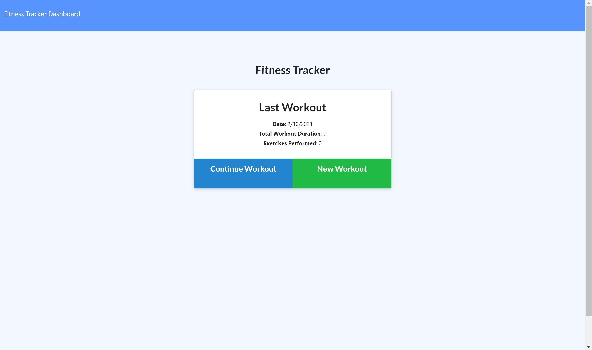
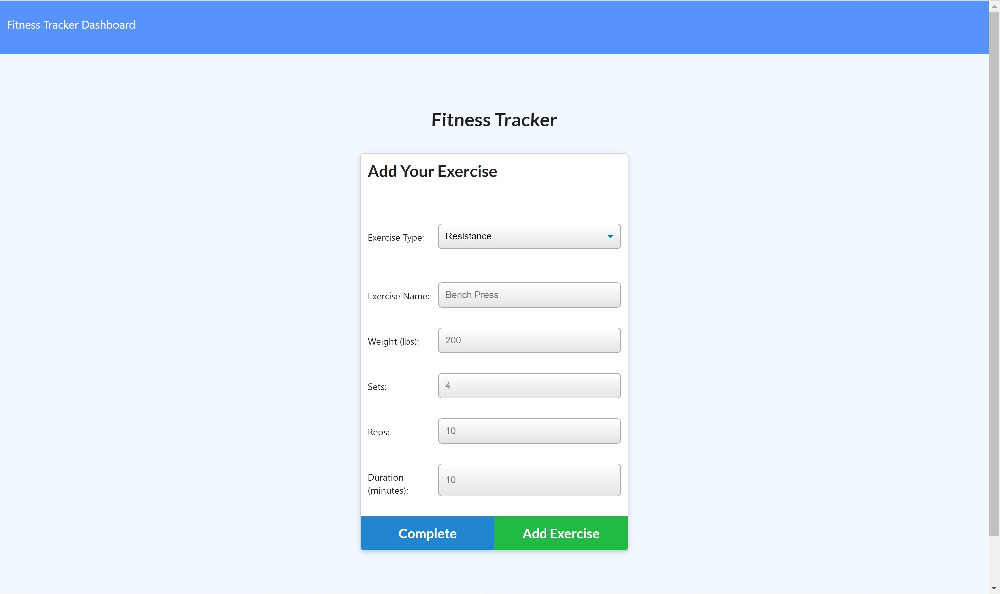
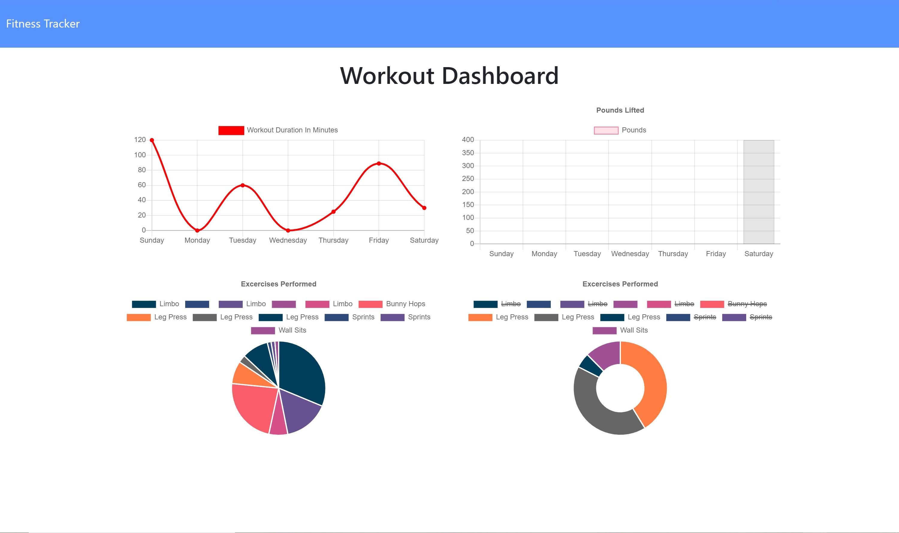

  <h1 align = "center">
  
   
  :muscle: Fitness-Tracker :muscle:
  </h1>
  
  
 
# Table of Contents

- [Description](#description)
- [Installation](#installation)
- [Usage](#usage)
- [Contributing](#contributing)
- [Test](#test)
- [Credits](#credits)
- [License](#license)
- [Questions](#questions)

## :memo: Description

This is a full-stack CRUD application that allows a user to add and update exercises using MongoDB to store, track, and
manipulate data. The dashboard features a GUI of graphs, tracking user workouts for each week.

## :camera: Visuals

  

  

  
  
## Installation:

    npm morgan|express|mongoose|mongoCompass and Atlas|dotenv|

## Usage:

    Using MongoDB, this application can store, track, update workouts for user to better plan out and complete workout activities.

## Credits:

    Trilogy Schools (U of M).

## Technologies Used:

    
    
    
    
    
    
    

## :copyright: License:

This project is subject to 

MIT License

        Copyright (c) [2021] [Demetri Dillard]

        Permission is hereby granted, free of charge, to any person obtaining a copy
        of this software and associated documentation files (the "Software"), to deal
        in the Software without restriction, including without limitation the rights
        to use, copy, modify, merge, publish, distribute, sublicense, and/or sell
        copies of the Software, and to permit persons to whom the Software is
        furnished to do so, subject to the following conditions:

        The above copyright notice and this permission notice shall be included in all
        copies or substantial portions of the Software.

        THE SOFTWARE IS PROVIDED "AS IS", WITHOUT WARRANTY OF ANY KIND, EXPRESS OR
        IMPLIED, INCLUDING BUT NOT LIMITED TO THE WARRANTIES OF MERCHANTABILITY,
        FITNESS FOR A PARTICULAR PURPOSE AND NONINFRINGEMENT. IN NO EVENT SHALL THE
        AUTHORS OR COPYRIGHT HOLDERS BE LIABLE FOR ANY CLAIM, DAMAGES OR OTHER
        LIABILITY, WHETHER IN AN ACTION OF CONTRACT, TORT OR OTHERWISE, ARISING FROM,
        OUT OF OR IN CONNECTION WITH THE SOFTWARE OR THE USE OR OTHER DEALINGS IN THE
        SOFTWARE.

For more information on this [License](https://choosealicense.com/licenses/mit/)

## Questions:question:

:email: For additional questions, Get in touch at: Meechlouch@gmail.com

:octocat: Check out my [GitHub](https://github.com/Meechlouch)

:octocat: GitHub [Repository](https://github.com/Meechlouch/Workout-Tracker)

:globe_with_meridians: Here is the [deployed](https://lit-scrubland-35061.herokuapp.com/) version.
